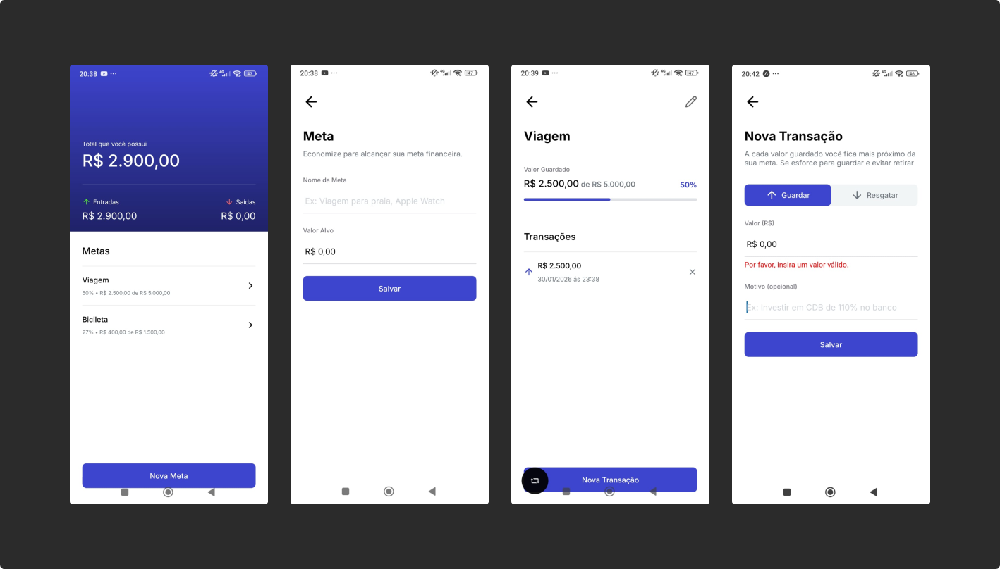

# TargetApp 🎯💵

&nbsp;

## 📚 Informações sobre o projeto

* O projeto consiste em um aplicativo de gerenciamento de gastos e metas financeiras, onde o usuário pode criar metas e registrar transações (entradas e saídas) associadas a cada meta.
O desenvolvimento foi realizado durante o módulo de Expo Router e Banco de Dados Local da Formação React Native da [Rocketseat](https://www.rocketseat.com.br/).
&nbsp;

## 💻 Funcionalidades do projeto

* Resumo Geral de Metas
* Criar Meta
* Editar Meta
* Excluir Meta
* Criar Transação(Entrada ou Saída)
* Editar Transação(Entrada ou Saída)
* Excluir Transação(Entrada ou Saída)
&nbsp;

## 🎨 Telas do projeto

&nbsp;

## 🛠️ Tecnologias/Ferramentas utilizadas

* React Native
* Expo
* Typescript
* Css
* SqlLite
* BeekeeperStudio
&nbsp;

---

Feito com 🧡 por <a href="https://jhonatas-portfolio.vercel.app/">Jhonatas Micael</a>

